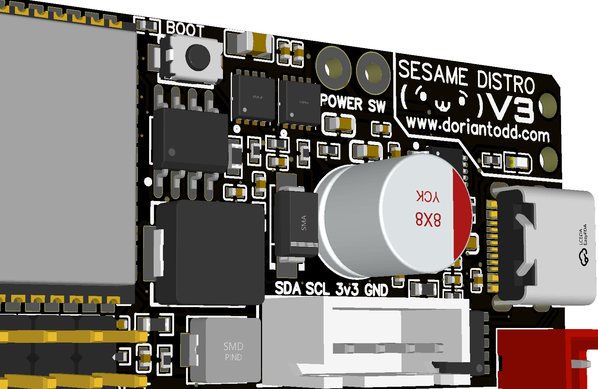
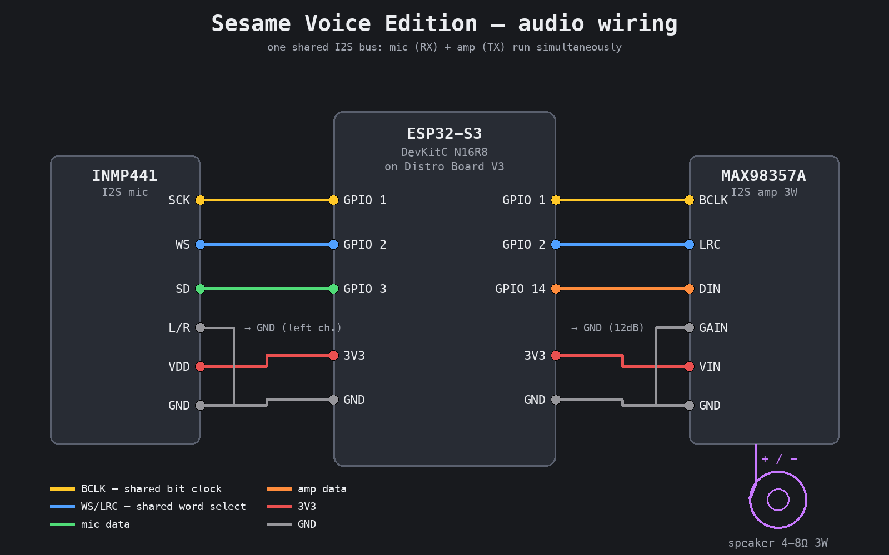
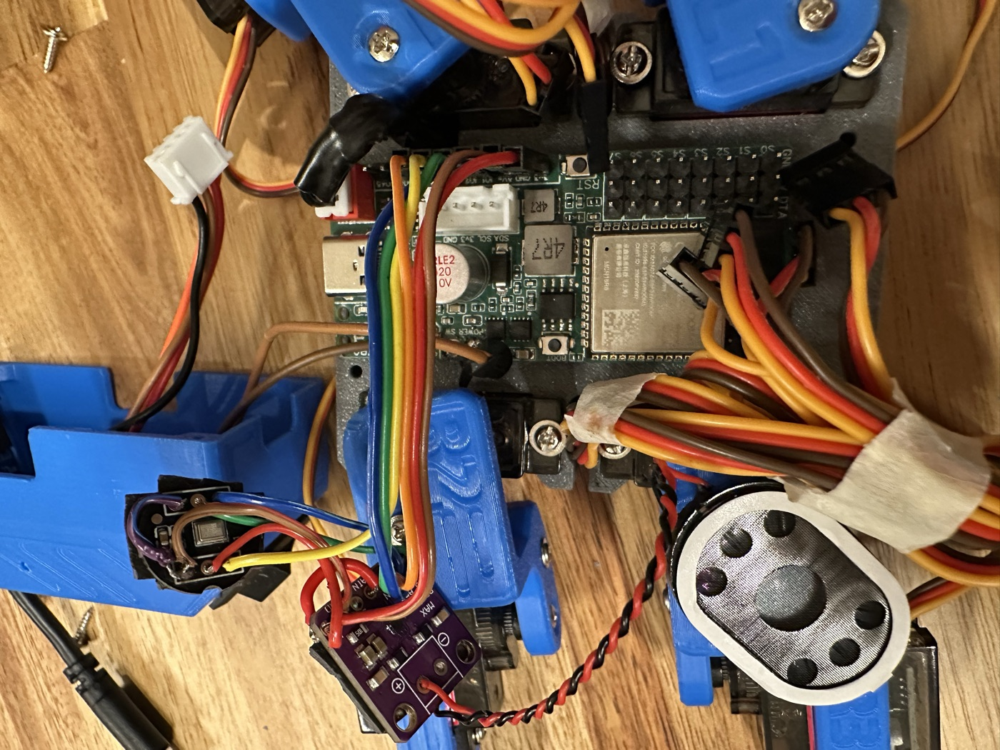
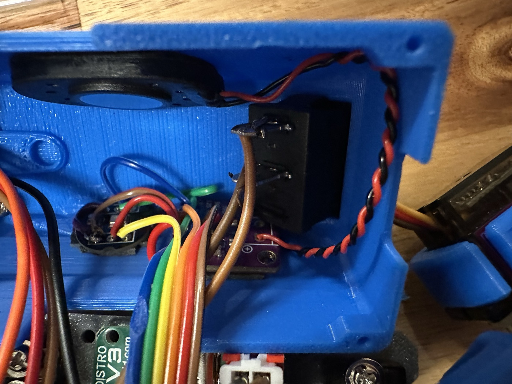

# Sesame Robot — Voice Edition

[](LICENSE)
[-orange.svg)]()
[]()

A **voice-assistant fork** of [dorianborian/sesame-robot](https://github.com/dorianborian/sesame-robot).
Say **"Hi ESP"** and Sesame listens: on-device wake-word detection, a microphone and
speaker in the body, and an AI brain on your laptop
([sesame-companion-app-sense](https://github.com/adiace/sesame-companion-app-sense)) that
understands speech, chats back, and drives the robot — all running locally, no cloud
accounts required.

All original Sesame movement sequences, OLED faces, and the web UI are preserved.
**Build the robot itself from the original repo** — its
[build guide](https://github.com/dorianborian/sesame-robot/tree/main/docs/build-guide),
[hardware files](https://github.com/dorianborian/sesame-robot/tree/main/hardware) (CAD,
STLs, Distro Board V3 PCB) and BOM are unchanged and not duplicated here. This repo adds
the voice hardware, the voice firmware, and the docs for both.

## What this fork adds

| | Original Sesame | This fork |
|---|---|---|
| Wake word | — | **"Hi ESP"** detected on-device (ESP-SR WakeNet, no laptop needed to wake) |
| Microphone | — | INMP441 I2S MEMS mic in the body |
| Speaker | — | MAX98357A I2S amp + 3W speaker: talks back, beeps, plays TTS |
| AI | — | Companion app: local Whisper STT → local LLM (Ollama) → TTS |
| Commands | Web UI buttons | Voice ("walk 5 steps then turn left"), TCP :8888, web UI, serial |
| Firmware updates | USB | **OTA over WiFi** (required once servos are attached — see below) |
| Servo PWM | 732–2929 µs | **500–2400 µs** (MG90S spec — no more stalling at hard stops) |
| Brownout | resets under load | disabled + staggered init + motor sleep (see [changes](#changes-from-the-original-firmware)) |
| Debugging | USB serial | WiFi log (port 8890) + live health JSON (`/api/status`) |

## Parts (voice upgrade only)

On top of a working Sesame with the **Distro Board V3**:

| Part | What it is | Notes |
|---|---|---|
| **ESP32-S3 DevKitC (N16R8)** | 16 MB flash / 8 MB PSRAM dev module | Replaces the S2 Mini — WakeNet needs the PSRAM, the wake model needs the flash |
| **INMP441** | I2S MEMS microphone breakout | ~$2. The robot's ear |
| **MAX98357A** | 3 W I2S class-D amplifier breakout | ~$2. The robot's voice box |
| **Speaker** | 4 Ω or 8 Ω, 2–3 W, ~28–40 mm | Fits in the body; bigger cone = louder |
| Hookup wire | ~10 short jumpers | |



## Wiring

The mic and amp **share** the I2S clock pins (one I2S bus, full duplex — the robot can
listen and talk at the same time).



| Wire | From (module pin) | To (ESP32-S3 pin) |
|---|---|---|
| Shared bit clock | INMP441 **SCK** + MAX98357A **BCLK** | **GPIO 1** |
| Shared word select | INMP441 **WS** + MAX98357A **LRC** | **GPIO 2** |
| Mic data | INMP441 **SD** | **GPIO 3** |
| Amp data | MAX98357A **DIN** | **GPIO 14** |
| Mic channel select | INMP441 **L/R** | **GND** (= left channel) |
| Amp gain select | MAX98357A **GAIN** | **GND** (= 12 dB — see table below) |
| Power | both modules **VDD/VIN** | **3V3** |
| Ground | both modules **GND** | **GND** |
| Speaker | MAX98357A **+ / −** | speaker terminals |

**MAX98357A GAIN pin** (counter-intuitive — wiring it to 3V3 makes it *quieter*):

| GAIN wiring | Gain |
|---|---|
| 100 kΩ to GND | 15 dB (max) |
| **direct to GND** | **12 dB (recommended)** |
| floating | 9 dB |
| direct to 3V3 | 6 dB |
| 100 kΩ to 3V3 | 3 dB (min) |

**Mic placement matters.** Mount the INMP441 with its port hole pressed directly against
a hole in the body shell, sealed with a ring of foam tape — an air gap between the mic
port and the shell muffles consonants and wrecks speech recognition.

The rest of the robot (servos on GPIO 4,5,6,7,10,11,12,13 · OLED on I2C SDA=GPIO 8 /
SCL=GPIO 9) is wired exactly as the V3 board build in the original repo. Full pin
reference: [docs/wiring.md](docs/wiring.md).

### Installed in the robot

Top-down with the shell open — Distro Board V3 center, MAX98357A amp (purple board,
bottom), speaker at the right, mic wiring running to the front cover:



Inside the top cover — speaker mounted behind the printed grille (top left), the amp
beside its mount with the twisted red/black pair to the speaker, and the INMP441 mic
at the left edge:



## Getting started

**1. Install the Arduino environment**

- [Arduino IDE](https://www.arduino.cc/en/software) 2.x
- In IDE Preferences → Additional Board Manager URLs, add:
  `https://espressif.github.io/arduino-esp32/package_esp32_index.json`
- Boards Manager → install **esp32 by Espressif** (3.x)
- Library Manager → install **Adafruit GFX** and **Adafruit SSD1306**

**2. Configure the board** (Tools menu — all four matter):

| Setting | Value |
|---|---|
| Board | ESP32S3 Dev Module |
| Flash Size | **16MB (128Mb)** |
| Partition Scheme | **Custom** (uses `firmware/partitions.csv`) |
| PSRAM | **OPI PSRAM** |
| Flash Mode | **QIO 80MHz** |

**3. Set your WiFi**

```bash
cd firmware
cp wifi_credentials.h.example wifi_credentials.h
# edit wifi_credentials.h — your SSID and password (this file is gitignored)
```

Also set your laptop's IP in `firmware/voice_config.h`
(find it with `ipconfig getifaddr en0` on a Mac).

**4. Flash — servos DISCONNECTED, over USB (one time)**

> ⚠️ **USB flashing only works with the servos unplugged.** With servos attached, their
> current draw crashes the board during a USB flash (USB 5V can't feed the servo rail).
> This first USB flash is the only one you'll ever need — everything after is OTA.

1. Plug in the board over USB, select its port, click **Upload**.
2. Flash the wake-word model (one time — it survives all future firmware updates):

```bash
esptool --chip esp32s3 -p /dev/cu.usbmodem101 write-flash 0xC10000 \
  ~/Library/Arduino15/packages/esp32/tools/esp32s3-libs/*/esp_sr/srmodels.bin
```

3. Open Serial Monitor (115200). You should see two beeps, then:
   `[Wake] Hi ESP ready` and `Network IP: ...`

**5. Reconnect servos — from now on, flash over WiFi (OTA)**

In the IDE: Tools → Port → **sesame-robot at sesame-robot.local** (network section),
password `sesame`. Or from a terminal:

```bash
espota.py -i sesame-robot.local -p 3232 --auth=sesame -f firmware.ino.bin
```

**6. Start the brain** — install and run
[sesame-companion-app-sense](https://github.com/adiace/sesame-companion-app-sense) on
your laptop (its README is a 3-step setup), then say **"Hi ESP"**, wait for the beep,
and talk: *"dance for me"*, *"walk 5 steps then turn left"*, *"tell me a joke"*.

## Changes from the original firmware

Beyond the voice features, this fork fixes several hardware-abuse issues:

- **Servo PWM range 500–2400 µs** (was 732–2929 µs). The original range exceeds the
  MG90S's physical travel, so high angles drove servos into their internal hard stop —
  buzzing, heat, and current spikes. 500/2400 is the MG90S spec: logical 0–180° now maps
  to real, reachable positions.
- **Brownout detector disabled** (`esp_brownout_init()` overridden). Multiple servos
  moving at once sag the rail enough to trip the ESP32-S3's brownout reset mid-walk.
- **Staggered servo init** — at boot, servos attach one at a time (100 ms apart) into the
  stand pose with saved trims, instead of all eight snapping at once (inrush current) or
  floating loose until the first command.
- **Motor sleep** — 5 minutes idle → rest pose, then servos fully detached (no hold
  current, no wear, no hum). `wake` (or any voice interaction) re-attaches.
- **Voice commands are bounded** — "walk" walks 8 steps and stops; "dance" dances once.
  The robot always returns to listening; it can't run away or dance forever because the
  wake word can't be heard mid-command.

## Documentation

| Doc | Contents |
|---|---|
| [docs/wiring.md](docs/wiring.md) | Every pin: I2S audio, servos, I2C/OLED, power, amp gain |
| [docs/setup.md](docs/setup.md) | IDE settings, model flash, WiFi, OTA — expanded from Getting started |
| [docs/commands.md](docs/commands.md) | Full command reference: TCP :8888, HTTP API, serial CLI |
| [docs/voice.md](docs/voice.md) | Voice pipeline internals, tuning knobs, debugging tools |
| [firmware/README.md](firmware/README.md) | What each firmware file does |

## Credits

Sesame was created by **Dorian Todd** — [dorianborian/sesame-robot](https://github.com/dorianborian/sesame-robot).
This fork adds the voice hardware and firmware; the robot design, movement sequences,
faces, and web UI are his work.
